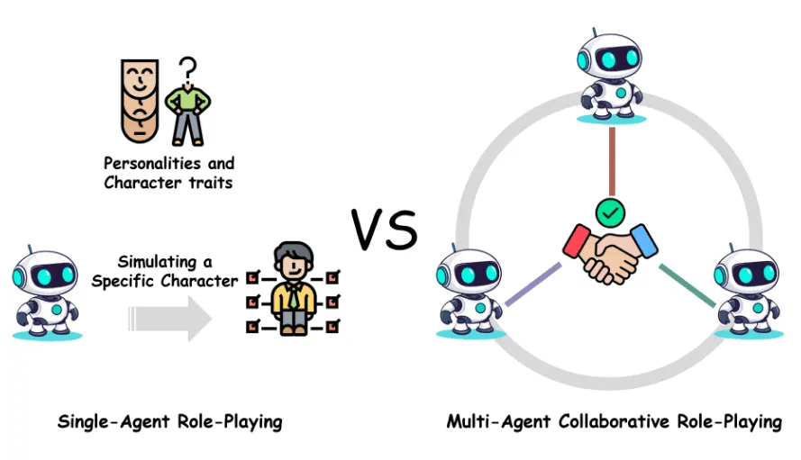

# Multi Agents Orchestration Samples
A sample project to show how to coordinate Multiple AI Agents by Semantic Kernel related packages and LLM APIs.  
  

## Solution Structure
- Shared Library: CommonShared
- Demo1: AgentGroupChat
- Demo2: Concurrent Mode
- Demo3: Sequential Mode
- Demo4: GroupChat Mode

## Related Blogs
- [QuickStart-AgentGroupChat](https://www.cnblogs.com/edisontalk/p/-/quick-start-agent-orchestration-agentgroupchat)
- [QuickStart-Concurrent Mode](https://www.cnblogs.com/edisontalk/p/-/quick-start-agent-orchestration-concurrent)
- [QuickStart-Sequential Mode](https://www.cnblogs.com/edisontalk/p/-/quick-start-agent-orchestration-sequential)
- [QuickStart-GroupChat Mode](https://www.cnblogs.com/edisontalk/p/-/quick-start-agent-orchestration-groupchat)

## Contact Me
Blog: https://edisontalk.cnblogs.com  
LinkedIn: https://www.linkedin.com/in/edisontalk